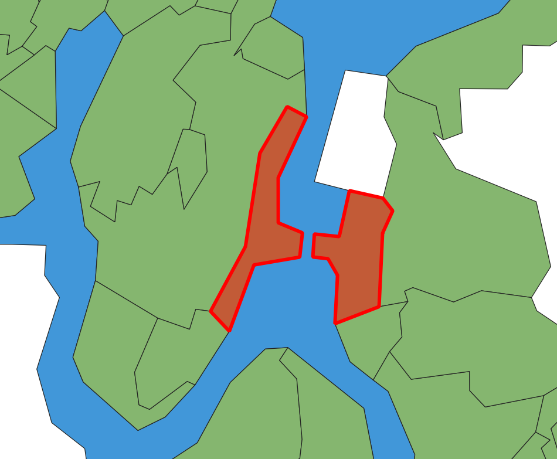
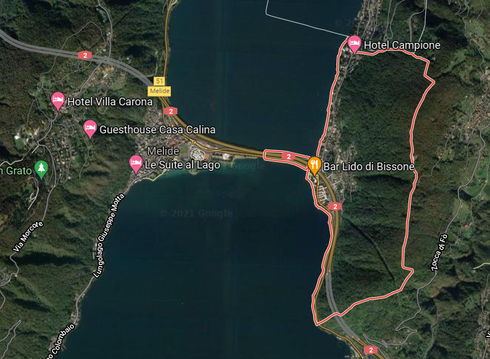
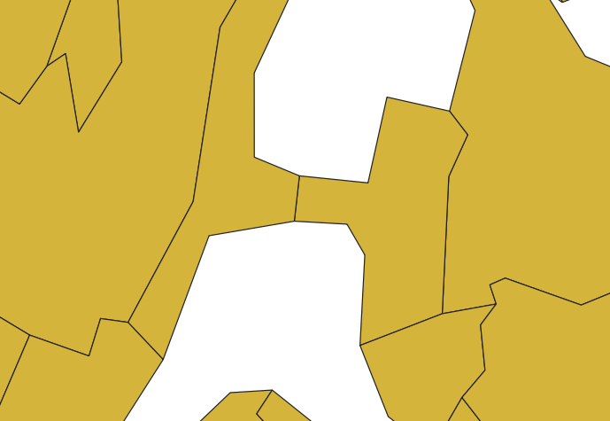
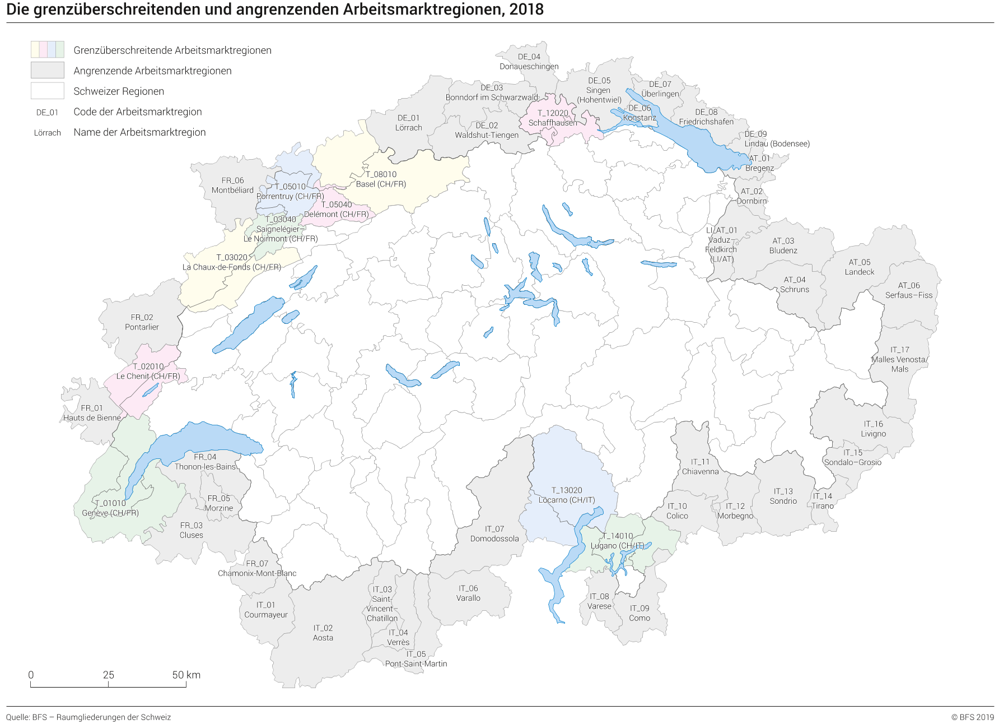

<!-- ----------------------------------------------------- -->

```{r setup, include = FALSE}
set.seed(12345)
options(scipen = 999)
options(max.print = "75")

library(pacman)
p_load(tidyverse, readxl, magrittr, 
       scales, janitor, lubridate, DT,
       sf, tmap)

tmap_options(check.and.fix = TRUE)

import::from("sjmisc", "frq")
```

```{r conflicts, include = FALSE}
tidyverse::tidyverse_conflicts()

conflicted::conflict_scout()
```

```{r knit-setup, include = FALSE}
knitr::opts_knit$set(root.dir = rprojroot::find_rstudio_root_file())

knitr::opts_chunk$set(cache = FALSE,
                      prompt = FALSE,
                      tidy = FALSE,
                      comment = NA,
                      message = FALSE,
                      warning = FALSE)

knitr::opts_knit$set(width = 75)

mu <- Hmisc::markupSpecs$html
```

<!-- ----------------------------------------------------- -->

# Data sources 

## BfS geodata 2021 {.tabset}

[Generalisierte Gemeindegrenzen: Geodaten](https://www.bfs.admin.ch/bfs/de/home/dienstleistungen/geostat/geodaten-bundesstatistik/administrative-grenzen/generalisierte-gemeindegrenzen.assetdetail.17964056.html).  

Contains three versions of data:  

> "Generalisierte Gemeindegrenzen, Stand 01.01.2021 & 18.04.2021 & 01.07.2021"	

**Using `01.07` release.**  

```{r eval=FALSE}
download.file(url = "https://www.bfs.admin.ch/bfsstatic/dam/assets/17964056/master",
              destfile = "data-raw/BfS/ag-b-00.03-875-gg21.zip",
              method = "curl")

unzip("data-raw/BfS/ag-b-00.03-875-gg21.zip", exdir = "data-raw/BfS/ag-b-00.03-875-gg21")

unlink("data-raw/BfS/ag-b-00.03-875-gg21.zip")
unlink("data-raw/BfS/ag-b-00.03-875-gg21/txt", recursive = TRUE)
unlink("data-raw/BfS/ag-b-00.03-875-gg21/kmz", recursive = TRUE)
unlink("data-raw/BfS/ag-b-00.03-875-gg21/ggg_2021-LV03", recursive = TRUE)
unlink("data-raw/BfS/ag-b-00.03-875-gg21/ggg_2021-LV95/ggg_2021-LV95.gdb", recursive = TRUE)
```

```{r warning=FALSE}
gg21 <- 
  st_read("data-raw/BfS/ag-b-00.03-875-gg21/ggg_2021-LV95/shp/g1g21_01072021.shp",
          as_tibble = TRUE) %>% 
  st_set_crs(2056) %>% 
  st_zm(drop = TRUE, what = "ZM")


kt21 <- 
  st_read("data-raw/BfS/ag-b-00.03-875-gg21/ggg_2021-LV95/shp/g1k21.shp",
          as_tibble = TRUE) %>% 
  st_zm(drop = TRUE, what = "ZM") %>% 
  st_transform(2056)

se21 <- 
  st_read("data-raw/BfS/ag-b-00.03-875-gg21/ggg_2021-LV95/shp/g1s21.shp",
          as_tibble = TRUE) %>% 
  filter(GMDNAME != "Lago di Como") %>% 
  st_zm(drop = TRUE, what = "ZM") %>% 
  st_transform(2056)
```

```{r include=FALSE}
unique(st_geometry_type(gg21))

# gg written alter after processing
write_rds(kt21, "data/BfS/kt21.Rds")
write_rds(se21, "data/BfS/se21.Rds")

st_write(kt21, "data/geo/BfS.gpkg", 
         layer = "kt21", delete_dsn = TRUE)
st_write(se21, "data/geo/BfS.gpkg", 
         layer = "se21", append = TRUE)
```

### Canton 

```{r echo=FALSE}
tm_shape(se21, is.master = FALSE) +
  tm_fill(col = "#a7cdf2")  +
  tm_shape(kt21) +
  tm_borders()
```

### Municipality 

```{r echo=FALSE}
tm_shape(se21, is.master = FALSE) +
  tm_fill(col = "#a7cdf2")  +
  tm_shape(gg21) +
  tm_borders()
```

## Alternative lakes dataset

Coming from Kartengeometrien ThemaKart - Set «PRO» 2019 available [here](https://www.bfs.admin.ch/bfs/de/home/statistiken/kataloge-datenbanken/karten.assetdetail.7546178.html).  

```{r}
se21_alt <- 
  st_read("data-raw/BfS/2019_THK_PRO/00_TOPO/K4_seenyyyymmdd/k4seenyyyymmdd_ch2007Poly.shp",
          as_tibble = TRUE) %>% 
  st_transform(2056)
```

That adds few smaller lakes (in red, without fill):  

```{r echo=FALSE}
tm_shape(se21, is.master = FALSE) +
  tm_fill(col = "#a7cdf2")  +
  tm_shape(se21_alt) +
  tm_borders(col = "red")
```

```{r include=FALSE}
write_rds(se21_alt, "data/BfS/se21_alt.Rds")

st_write(se21_alt, "data/geo/BfS.gpkg", 
         layer = "se21_alt", append = TRUE)
```

## swisstopo geodata 2021

### Boundaries

`swissBOUNDARIES3D` data available from [here](https://www.swisstopo.admin.ch/de/geodata/landscape/boundaries3d.html). Also exist in July versions.  

```{r eval=FALSE}
download.file(url = "https://data.geo.admin.ch/ch.swisstopo.swissboundaries3d/swissboundaries3d_2021-07/swissboundaries3d_2021-07_2056_5728.shp.zip",
              destfile = "data-raw/swisstopo/swissboundaries3d_2021-07_2056_5728.shp.zip",
              method = "curl")

unzip("data-raw/swisstopo/swissboundaries3d_2021-07_2056_5728.shp.zip", 
      exdir = "data-raw/swisstopo/swissboundaries3d_2021-07_2056_5728")

unlink("data-raw/swisstopo/swissboundaries3d_2021-01_2056_5728.shp.zip")
```

```{r}
st_gg21 <- 
  st_read("data-raw/swisstopo/swissboundaries3d_2021-07_2056_5728/SHAPEFILE_LV95_LN02/swissBOUNDARIES3D_1_3_TLM_HOHEITSGEBIET.shp",
          as_tibble = TRUE) %>% 
  st_zm(drop = TRUE, what = "ZM") %>% 
  st_transform(2056) 

st_kt21 <- 
  st_read("data-raw/swisstopo/swissboundaries3d_2021-07_2056_5728/SHAPEFILE_LV95_LN02/swissBOUNDARIES3D_1_3_TLM_KANTONSGEBIET.shp",
          as_tibble = TRUE) %>% 
  st_zm(drop = TRUE, what = "ZM") %>% 
  st_transform(2056)
```

```{r include=FALSE}
unique(st_geometry_type(st_gg21))
unique(st_geometry_type(st_kt21))

# st_gg written after processing
write_rds(st_kt21, "data/swisstopo/st_kt21.Rds")

st_write(st_kt21, "data/geo/swisstopo.gpkg", 
         layer = "st_kt21", delete_dsn = TRUE)
```

### Lakes 

Additional dataset of lakes was derived from `swissTLM3D_TLM_STEHENDES_GEWAESSER.shp` layer from `swissTLM3D` [dataset](https://www.swisstopo.admin.ch/de/geodata/landscape/tlm3d.html).  

```{r eval=FALSE}
# convert lines to polygons, calculate area

# testing is good here:
# "NAME" = 'Bodensee | Lac de Constance | Lago di Costanza | Lai da Constanza'

st_se21 <- 
  st_read("data-raw/swisstopo/swisstlm3d_2021-04_2056_5728.shp/swissTLM3D_TLM_STEHENDES_GEWAESSER.shp",
          as_tibble = TRUE) %>% 
  st_zm(drop = TRUE, what = "ZM") %>% 
  filter(OBJEKTART == "See") %>% 
  group_by(GEW_LAUF_U) %>% 
  summarise(geometry = st_combine(geometry),
            NAME = first(NAME),
            OBJEKTART = first(OBJEKTART)) %>%
  st_cast("MULTILINESTRING") %>% 
  st_polygonize() %>%
  mutate(area = st_area(.)) %>% 
  ungroup() %>% 
  relocate(geometry, .after = last_col())

st_see21_insel <- 
  st_read("data-raw/swisstopo/swisstlm3d_2021-04_2056_5728.shp/swissTLM3D_TLM_STEHENDES_GEWAESSER.shp",
          as_tibble = TRUE) %>% 
  st_zm(drop = TRUE, what = "ZM") %>% 
  filter(OBJEKTART == "Seeinsel") %>% 
  group_by(GEW_LAUF_U) %>% 
  summarise(geometry = st_combine(geometry),
            NAME = first(NAME),
            OBJEKTART = first(OBJEKTART)) %>%
  st_cast("MULTILINESTRING") %>% 
  st_polygonize() %>% 
  mutate(area = st_area(.)) %>% 
  ungroup() %>% 
  relocate(geometry, .after = last_col())

st_se21 <- 
  st_difference(st_se21, st_union(st_see21_insel)) %>% 
  st_collection_extract("POLYGON") %>% 
  st_zm(drop = TRUE, what = "ZM") %>% 
  st_transform(2056)

unique(st_geometry_type(st_se21))

frq(st_is_valid(st_se21))

summary(st_se21$area)

plot(st_se21[, 2])

rm(st_see21_insel); gc()
```

```{r eval=FALSE, include=FALSE}
# st_write(st_se21, "data/swisstopo/st_se21.gpkg", layer = "lakes", delete_dsn = TRUE)
# st_write(st_see21_insel, "data/swisstopo/st_se21.gpkg", layer = "st_see21_insel", append = TRUE)

write_rds(st_se21, "data/swisstopo/st_se21.Rds") 

st_write(st_se21, "data/geo/swisstopo.gpkg", 
         layer = "st_se21", append = TRUE)
```

### Combined 

```{r include=FALSE}
st_se21_sel <- read_rds("data/swisstopo/st_se21.Rds") %>% 
  st_filter(se21_alt)

write_rds(st_se21_sel, "data/swisstopo/st_se21_sel.Rds") 

st_write(st_se21_sel, "data/geo/swisstopo.gpkg", 
         layer = "st_se21_sel", append = TRUE)
```

Lakes dataset (selecting only `r nrow(se21_alt)` largest features from ThemaKart dataset) was then used to erase area of municipalities that extends over lakes. Issue is described in [#48](https://github.com/RPanczak/ISPM_geo-mortality/issues/48).  

```{r warning=FALSE}
st_gg21 <- 
  st_difference(st_gg21, st_union(st_se21_sel)) %>% 
  # small slivers of lakes left
  filter(OBJEKTART != "Kantonsgebiet") %>% 
  st_collection_extract("POLYGON") %>% 
  st_zm(drop = TRUE, what = "ZM") %>% 
  st_transform(2056) 
```

```{r eval=FALSE, include=FALSE}
unique(st_geometry_type(st_gg21))

# if needed as POLYGON (not MULTI)
# remove st_collection_extract() above
# and run this one

temp <- rbind(
  st_gg21 %>%
    filter(st_is(geometry, "POLYGON")),
  
  st_gg21 %>%
    filter(st_is(geometry, "MULTIPOLYGON")) %>% 
    st_cast("POLYGON")
)

unique(st_geometry_type(temp))

# another way to convert mixed types
st_gg21 %<>% 
  group_by(BFS_NUMMER) %<>% 
  summarise(BFS_NUMMER = first(BFS_NUMMER),
            NAME = first(NAME),
            GEM_TEIL = max(GEM_TEIL)) %>%
  st_cast("MULTIPOLYGON") 
```

## Important differences

### Resolution

swisstopo files (in blue below) are larger in size (and slower to plot) but offer better resolution and will be used for certain spatial operations (like linking to SEP) whereas BfS data (in red) are smaller in size and faster to plot. Example of municipality Bern:  

```{r echo=FALSE}
tm_shape(st_gg21 %>% filter(BFS_NUMMER == 351)) +
  tm_borders(col = "blue", lwd = 1, alpha = 0.5) +
  tm_shape(gg21 %>% filter(GMDNR == 351)) +
  tm_borders(col = "red", lwd = 2, alpha = 0.5) +
  tm_layout(
    title = "Different spatial resolutions"
  )
```

### Multipart features

BfS originally stores data as `MULTIPOLYGON`. In such case municipality split over several disconnected areas is stored as *single record*. Example of municipality Monthey which consists of four separate areas:  

```{r echo=FALSE}
gg21 %>% 
  filter(GMDNR == 6153) %>% 
  mutate(GEM_TEIL = "1") %>% 
  select(GEM_TEIL) %>% 
  plot()
```

```{r eval=FALSE, include=FALSE}
# if polygons are needed
gg21 %>% 
  filter(GMDNR == 6153) %>% 
  st_cast("POLYGON")
```

The same municipality in swisstopo data is stored as **set of** `MULTIPOLYGON` types and is represented by *four separate records* instead of one.  

```{r echo=FALSE}
st_gg21 %>% 
  filter(BFS_NUMMER == 6153) %>%
  select(GEM_TEIL, geometry) %>% 
  plot()
```

That might have some implications in terms of spatial operations (maybe contiguity too?). Data can easily be converted between types if needed. 

<!-- ----------------------------------------------------- -->

# Preparations

## Disconnected boundaries

Two communities in TI *Bissone* & *Melide* are disconnected by Lake Lugano in BfS municipality data:


In reality communities are rather connected:


That has been manually corrected in GIS and now looks like:


Importance of this issue is covered [here](https://doi.org/10.1016/j.sste.2018.04.002).  

```{r include=FALSE}
gg21 <- 
  st_read("data/geo/g1g21_01072021_cor.shp",
          as_tibble = TRUE) %>% 
  st_set_crs(2056)

# table(st_is_valid(gg21))
```

This doesn't cause problem in swisstopo data. 

```{r echo=FALSE}
tm_shape(st_se21_sel %>% 
           filter(NAME == "Ceresio | Lago di Lugano | Lac de Lugano | Lai da Lugano | Luganersee")) +
  tm_fill(col = "gray", alpha = 0.5) +
  tm_shape(st_gg21 %>% filter(BFS_NUMMER %in% c(5154, 5198)), 
           is.master = TRUE) +
  tm_polygons("NAME", lwd = 1, alpha = 0.5) +
  tm_layout(
    # title = "Connectivity issue Lago di Lugano"
  )
```

## Non-residential municipalities

Excluding municipalities without residents:  

- `Staatswald Galm`  
- `Comunanza Cadenazzo/Monteceneri`  
- `Comunanza Capriasca/Lugano`  

We should not expect any cases there!  

```{r}
gg21 %>% 
  st_drop_geometry() %>% 
  filter(GMDNR %in% c(2391, 5391, 5394)) %>% 
  select(GMDNAME)
```

```{r include=FALSE}
gg21 %<>% 
  filter(! GMDNR %in% c(2391, 5391, 5394)) %>% 
  select(GMDNR, GMDNAME, BZNR, KTNR) %>% 
  arrange(GMDNR)

st_gg21 %<>% 
  filter(! BFS_NUMMER %in% c(2391, 5391, 5394)) %>% 
  # exclude lakes
  filter(OBJEKTART != "Kantonsgebiet") %>% 
  # exclude FL & enclaves
  filter(ICC == "CH") %>% 
  select(BFS_NUMMER, NAME, BEZIRKSNUM, KANTONSNUM, GEM_TEIL) %>% 
  rename(GMDNR = BFS_NUMMER,
         GMDNAME = NAME,
         BZNR = BEZIRKSNUM,
         KTNR = KANTONSNUM) %>% 
  arrange(GMDNR)
```

```{r eval=FALSE, include=FALSE}
# should be exact overlap
gg21 %>%
  filter(! GMDNR %in% st_gg21$GMDNR) %>% 
  nrow()

st_gg21 %>%
  filter(! GMDNR %in% gg21$GMDNR) %>% 
  nrow()
```

## Labour market areas 2018

### Data sources 

More info [here](https://www.bfs.admin.ch/bfs/de/home/aktuell/neue-veroeffentlichungen.gnpdetail.2019-0439.html).  

```{r}
raum <- read_xlsx("data-raw/BfS/Raumgliederungen.xlsx", 
                  skip = 1) %>% 
  remove_empty(c("rows", "cols")) %>% clean_names() %>% 
  filter(! is.na(bfs_gde_nummer)) %>% 
  rename(GMDNR = bfs_gde_nummer,
         GMDNAME = gemeindename,
         KTNAME = kanton,
         BZNAME = bezirksname,
         ARGRNR = arbeitsmarktgrossregionen_2018,
         ARNR = arbeitsmarktregionen_2018) %>% 
  select(GMDNR, GMDNAME,
         KTNAME, BZNAME, 
         ARGRNR, ARNR) %>% 
  left_join(
    read_xlsx("data-raw/BfS/Raumgliederungen.xlsx", 
              skip = 1, sheet = "CH1+CL_GBAE+2018.0") %>% 
      rename(
        ARGRNR = Code,
        ARGRNAME = Label)
  ) %>% 
  left_join(
    read_xlsx("data-raw/BfS/Raumgliederungen.xlsx", 
              skip = 1, sheet = "CH1+CL_BAE+2018.0") %>% 
      rename(
        ARNR = Code,
        ARNAME = Label) 
  ) %>% 
  relocate(ARGRNAME, .after = ARGRNR) %>% 
  relocate(ARNAME, .after = ARNR) %>% 
  mutate(border = if_else(ARNAME %in% c("Schaffhausen", "Basel", 
                                        "Delémont", "Porrentruy", "Saignelégier–Le Noirmont", "La Chaux-de-Fonds",
                                        "Le Chenit", "Genève",
                                        "Locarno", "Lugano"), 
                          1, 0))
```

```{r include=FALSE}
write_rds(raum, "data/BfS/raum.Rds")
```

Number of municipalities that are located within border labour market areas:  

```{r echo=FALSE}
frq(raum, border)
```

### Preps

List of regions was merged on the basis of municipality number and then these municipalities were aggregated.  

```{r eval=FALSE}
argr_21 <- gg21 %>% 
  left_join(raum) %>% 
  group_by(ARGRNR) %>% 
  summarise(ARGRNR = first(ARGRNR),
            ARGRNAME = first(ARGRNAME)) %>%
  st_cast("MULTIPOLYGON") 

ar_21 <- gg21 %>% 
  left_join(raum) %>% 
  group_by(ARNR) %>% 
  summarise(ARNR = first(ARNR),
            ARNAME = first(ARNAME),
            border = first(border)) %>%
  st_cast("MULTIPOLYGON")
```

Dissolving of BfS data via R was not perfect and manual corrections were implemented in QGIS software.  

```{r}
# st_write(argr_21, "data/geo/argr_21_cor.shp", delete_dsn = TRUE)
# st_write(ar_21, "data/geo/ar_21_cor.shp", delete_dsn = TRUE)

argr_21 <- st_read("data/geo/argr_21_cor.shp") %>% 
  select(-ARGRNAME) %>% 
  left_join(raum %>% select(ARGRNR, ARGRNAME)) %>% 
  group_by(ARGRNR) %>% 
  summarise(ARGRNR = first(ARGRNR),
            ARGRNAME = first(ARGRNAME)) %>%
  st_cast("MULTIPOLYGON") 

ar_21 <- st_read("data/geo/ar_21_cor.shp") %>% 
  select(-ARNAME) %>% 
  left_join(raum %>% select(ARNR, ARNAME, border)) %>% 
  group_by(ARNR) %>% 
  summarise(ARNR = first(ARNR),
            ARNAME = first(ARNAME),
            border = first(border)) %>%
  st_cast("MULTIPOLYGON")
```

```{r include=FALSE}
unique(st_geometry_type(argr_21))
unique(st_geometry_type(ar_21))

# some dramas here
table(st_is_valid(argr_21))
table(st_is_valid(ar_21))

ar_21 %>% 
  filter(!st_is_valid(.)) %>% 
  select(ARNAME)

# fixing with this
ar_21 <- st_make_valid(ar_21)
table(st_is_valid(ar_21))

write_rds(argr_21, "data/BfS/argr_21.Rds")
write_rds(ar_21, "data/BfS/ar_21.Rds")

st_write(argr_21, "data/geo/BfS.gpkg", 
         layer = "argr_21", append = TRUE)
st_write(ar_21, "data/geo/BfS.gpkg", 
         layer = "ar_21", append = TRUE)
```

```{r eval=FALSE, include=FALSE}
p_load(cleangeo)

sp <- rgdal::readOGR("data/geo/ar_21_cor.shp")

sp.report <- clgeo_CollectionReport(sp)
sp.summary <- clgeo_SummaryReport(sp.report)
sp.fixed <- clgeo_Clean(sp, verbose = TRUE)

map_centre <- st_sfc(st_point(c(2717542, 1090036)), crs = 2056) %>% 
  st_as_sf()

map_centre_b <- map_centre %>% 
  st_buffer(10000) %>% 
  st_as_sf()

tmap_mode("plot")
tm_shape(map_centre_b) +
  tm_borders(col = "blue", lwd = 1, alpha = 0.5) +
  tm_shape(map_centre) +
  tm_symbols() +
  tm_shape(ar_21_cor) +
  tm_borders(col = "red", lwd = 2, alpha = 0.5) 

tmap_mode("plot")
tm_shape(map_centre_b) +
  tm_borders(col = "blue", lwd = 1, alpha = 0.5) +
  tm_shape(ar_21_cor) +
  tm_borders(col = "red", lwd = 2, alpha = 0.5) 

rm(sp, sp.report, sp.summary, sp.fixed, map_centre, map_centre_b); gc()
p_unload(cleangeo)
```

Dissolve in R using swisstopo data was all fine.  

```{r}
# same for swisstopo
# removing '-' from names which causes problems with writing shp
st_argr_21 <- st_gg21 %>% 
  left_join(raum) %>% 
  group_by(ARGRNR) %>% 
  summarise(ARGRNR = first(ARGRNR),
            ARGRNAME = first(ARGRNAME)) %>%
  st_cast("MULTIPOLYGON") %>% 
  mutate(ARGRNAME = str_replace_all(ARGRNAME, "–", " "))

st_ar_21 <- st_gg21 %>% 
  left_join(raum) %>% 
  group_by(ARNR) %>% 
  summarise(ARNR = first(ARNR),
            ARNAME = first(ARNAME),
            border = first(border)) %>%
  st_cast("MULTIPOLYGON") %>% 
  mutate(ARNAME = str_replace_all(ARNAME, "–", " "))
```

```{r include=FALSE}
st_write(st_argr_21, "data/geo/swisstopo.gpkg", 
         layer = "st_argr_21", append = TRUE)
st_write(st_ar_21, "data/geo/swisstopo.gpkg", 
         layer = "st_ar_21", append = TRUE)

write_rds(st_argr_21, "data/swisstopo/st_argr_21.Rds")
write_rds(st_ar_21, "data/swisstopo/st_ar_21.Rds")
```

```{r eval=FALSE, include=FALSE}
p_load(cleangeo)

sp <- rgdal::readOGR("data/geo/st_ar_21.shp")

sp.report <- clgeo_CollectionReport(sp)
sp.summary <- clgeo_SummaryReport(sp.report)
sp.fixed <- clgeo_Clean(sp, verbose = TRUE)

map_centre <- st_sfc(st_point(c(2717542, 1090036)), crs = 2056) %>% 
  st_as_sf()

map_centre_b <- map_centre %>% 
  st_buffer(10000) %>% 
  st_as_sf()

tmap_mode("plot")
tm_shape(map_centre_b) +
  tm_borders(col = "blue", lwd = 1, alpha = 0.5) +
  tm_shape(map_centre) +
  tm_symbols() +
  tm_shape(ar_21_cor) +
  tm_borders(col = "red", lwd = 2, alpha = 0.5) 

tmap_mode("plot")
tm_shape(map_centre) +
  tm_borders(col = "blue", lwd = 1, alpha = 0.5) +
  tm_shape(ar_21_cor) +
  tm_borders(col = "red", lwd = 2, alpha = 0.5) 


rm(sp, sp.report, sp.summary, sp.fixed, map_centre, map_centre_b); gc()
p_unload(cleangeo)
```

```{r echo=FALSE}
tm_shape(se21, is.master = FALSE) +
  tm_fill(col = "lightskyblue", alpha = 0.5) +
  tm_shape(ar_21, is.master = TRUE) +
  tm_borders(col = "darkgray", lwd = 1, alpha = 0.5) +
  tm_shape(argr_21) +
  tm_borders(col = "darkorchid", lwd = 2, alpha = 0.5) +
  tm_layout(
    title = "Labour market regions 2021"
  )
```

```{r eval=FALSE, include=FALSE}
tm_shape(se21, is.master = FALSE) +
  tm_fill(col = "lightskyblue", alpha = 0.5) +
  tm_shape(st_ar_21, is.master = TRUE) +
  tm_borders(col = "darkgray", lwd = 1, alpha = 0.5) +
  tm_shape(st_argr_21) +
  tm_borders(col = "darkorchid", lwd = 2, alpha = 0.5) +
  tm_layout(
    title = "Labour market regions 2021"
  )
```

### Border regions

Defined on the basis of [this map](https://www.bfs.admin.ch/bfs/de/home/aktuell/neue-veroeffentlichungen.assetdetail.8706500.html). Linked by name of the region since some codes seemed to be out of date? (ie. Basel).  



```{r echo=FALSE}
tm_shape(se21, is.master = FALSE) +
  tm_fill(col = "lightskyblue", alpha = 0.5) +
  tm_shape(ar_21 %>% mutate(border = factor(border))) +
  tm_fill(col = "border", lwd = 2, alpha = 0.66, 
          palette = "Set2", n = 2,
          legend.show = FALSE) +
  tm_shape(ar_21) +
  tm_borders(col = "white") +
  tm_layout(
    title = "Border regions 2021"
  )
```

```{r echo=FALSE}
ar_21 %>% 
  st_drop_geometry() %>% 
  filter(border == 1) %>%  
  select(-border) %>% 
  datatable() 
```

The same typology can be applied to municipalities:  

```{r echo=FALSE}
tm_shape(se21, is.master = FALSE) +
  tm_fill(col = "lightskyblue", alpha = 0.5) +
  tm_shape(gg21 %>% left_join(raum) %>% mutate(border = factor(border))) +
  tm_fill(col = "border", lwd = 2, alpha = 0.66, palette = "Set2", n = 2,
          legend.show = FALSE) +
  tm_shape(gg21) +
  tm_borders(col = "white") +
  tm_layout(
    title = "Border municipalities 2021"
  )
```

```{r echo=FALSE}
gg21 %>% 
  st_drop_geometry() %>% 
  left_join(raum) %>% 
  filter(border == 1) %>%  
  select(GMDNAME, BZNAME, ARGRNAME, ARNAME) %>% 
  datatable() 
```

```{r}
gg21 %>% left_join(raum %>% select(GMDNR, KTNAME, BZNAME, 
                                   ARGRNR, ARGRNAME, ARNR, ARNAME,
                                   border)) %>% 
  relocate(geometry, .after = last_col()) %>% 
  write_rds("data/BfS/gg21.Rds")

gg21 %>% left_join(raum %>% select(GMDNR, KTNAME, BZNAME, 
                                   ARGRNR, ARGRNAME, ARNR, ARNAME,
                                   border)) %>% 
  relocate(geometry, .after = last_col()) %>%
  st_write("data/geo/BfS.gpkg", 
           layer = "gg21", append = TRUE)

st_gg21 %>% left_join(raum %>% select(GMDNR, KTNAME, BZNAME, 
                                      ARGRNR, ARGRNAME, ARNR, ARNAME,
                                      border)) %>% 
  relocate(geometry, .after = last_col()) %>% 
  write_rds("data/swisstopo/st_gg21.Rds")

st_gg21 %>% left_join(raum %>% select(GMDNR, KTNAME, BZNAME, 
                                      ARGRNR, ARGRNAME, ARNR, ARNAME,
                                      border)) %>% 
  relocate(geometry, .after = last_col()) %>% 
  st_write("data/geo/swisstopo.gpkg", 
           layer = "st_gg21", append = TRUE)
```

<!-- ----------------------------------------------------- -->

# tg3o simplification

So called 'productive areas', also coming from BfS' ThemaKart product.  

Roughly coincides with removing areas of above 2000m asl.  

```{r}
tg3o <- 
  st_read("data-raw/BfS/2019_THK_PRO/01_INST/Vegetationsfläche_vf/K4_suis18480101_vf/K4suis18480101vf_ch2007Poly.shp",
          as_tibble = TRUE) %>% 
  st_transform(2056)
```

```{r}
qtm(tg3o)
```

## swisstopo {.tabset}

### Municipality

```{r include=FALSE}
st_gg21_tg3o <- st_intersection(st_gg21, tg3o) %>% 
  st_collection_extract("POLYGON")

frq(st_is_valid(st_gg21_tg3o))

write_rds(st_gg21_tg3o, "data/geo/st_gg21_tg3o.Rds")

st_write(st_gg21_tg3o, "data/geo/tg3o.gpkg", 
         layer = "st_gg21_tg3o", append = TRUE)
```

```{r echo=FALSE}
qtm(st_gg21_tg3o)
```

### AR 

```{r include=FALSE}
st_ar_21_tg3o <- st_intersection(st_ar_21, tg3o) %>% 
  st_collection_extract("POLYGON")

frq(st_is_valid(st_ar_21_tg3o))

write_rds(st_ar_21_tg3o, "data/geo/st_ar_21_tg3o.Rds")

st_write(st_ar_21_tg3o, "data/geo/tg3o.gpkg", 
         layer = "st_ar_21_tg3o", append = TRUE)
```

```{r echo=FALSE}
qtm(st_ar_21_tg3o)
```

## BfS

### Municipality

```{r include=FALSE}
gg21_tg3o <- st_intersection(gg21, tg3o) %>% 
  st_collection_extract("POLYGON") 

frq(st_is_valid(gg21_tg3o))

write_rds(gg21_tg3o, "data/geo/gg21_tg3o.Rds")

st_write(gg21_tg3o, "data/geo/tg3o.gpkg", 
         layer = "gg21_tg3o", append = TRUE)
```

```{r echo=FALSE}
qtm(gg21_tg3o)
```

### AR 

```{r include=FALSE}
ar_21_tg3o <- st_intersection(ar_21, tg3o) %>% 
  st_collection_extract("POLYGON") %>% 
  group_by(ARNR) %>% 
  summarise(geometry = st_combine(geometry),
            ARNAME = first(ARNAME),
            ARNR = first(ARNR)) %>%
  ungroup()

frq(st_is_valid(ar_21_tg3o))

write_rds(ar_21_tg3o, "data/geo/ar_21_tg3o.Rds")

st_write(ar_21_tg3o, "data/geo/tg3o.gpkg", 
         layer = "ar_21_tg3o", append = TRUE)
```

```{r echo=FALSE}
qtm(ar_21_tg3o)
```

## Slivers

```{r include=FALSE}
tg3o_gem <- 
  st_read("data-raw/BfS/2019_THK_PRO/01_INST/Vegetationsfläche_vf/K4_polg20190101_vf/K4polg20190101vf_ch2007Poly.shp",
          as_tibble = TRUE) %>% 
  st_transform(2056)
```

```{r echo=FALSE}
tm_shape(st_gg21 %>% 
           filter(GMDNR %in% c(3961, 3945, 3947, 3862)), 
         is.master = TRUE) +
  tm_polygons(col = "GMDNAME", border.col = NA, alpha = 0.5) +
  tm_shape(st_gg21_tg3o) +
  tm_polygons(col = "red", border.col = "red", alpha = 0.5) +
  tm_layout(
    # title = "Connectivity issue Lago di Lugano"
  )
```

<!-- ----------------------------------------------------- -->

# Municipality boundaries mutations

Using `Gemeindestand - Stand vom 01.07.2021.xlsx` from [here](https://www.agvchapp.bfs.admin.ch/de/home) we can identify municipalities with changes during the study period.  

```{r}
histcomm <- read_xlsx("data-raw/BfS/Mutierte_Gemeinden_20150101_bis_20210701.xlsx", 
                      col_types = c("numeric", "text", "numeric", 
                                    "numeric", "text", "text", "numeric", 
                                    "numeric", "text", "text"), 
                      skip = 1) %>%
  remove_empty(c("rows", "cols")) %>% clean_names() %>% 
  mutate(datum_der_aufnahme = ymd(datum_der_aufnahme)) %>% 
  arrange(desc(datum_der_aufnahme), gemeindename_5) %>% 
  rename(kanton_old = kanton_2,
         bezirks_num_old = bezirks_nummer_3,
         bfs_gde_num_old = bfs_gde_nummer_4,
         gemeindename_old = gemeindename_5,
         kanton_new = kanton_6,
         bezirks_num_new = bezirks_nummer_7,
         bfs_gde_num_new = bfs_gde_nummer_8,
         gemeindename_new = gemeindename_9)
```

```{r include=FALSE}
write_rds(histcomm, "data/BfS/histcomm.Rds")
```

There were `r length(unique(histcomm$bezirks_num_old))` municipalities with changes recorded in `2015-01-01` - `2021-07-01` period.  

Here is list of changes from `2020-01-01` onwards that could affect other data that date for instance refer to  `2020-12-31`:  

```{r echo=FALSE}
histcomm %>% 
  filter(datum_der_aufnahme >= ymd("2021-01-01")) %>% 
  select(-kanton_new, -bezirks_num_old, -bezirks_num_new) %>% 
  datatable()
```

Luckily only few changes occurred after `2021-01-01` and it was a fusion which is easier to handle.  

```{r eval=FALSE, include=FALSE}
# Auf den 18. April 2021 fusionierten die ehemaligen politischen Gemeinden Croglio, Monteggio, Ponte Tresa und Sessa zur neuen politischen Gemeinde Tresa

histcomm %>% 
  filter(bfs_gde_nummer %in% c(5239))

histcomm %>% 
  filter(bfs_gde_nummer %in% c(5178, 5202, 5213, 5222))

gg21 %>% 
  st_drop_geometry() %>% 
  filter(GMDNR %in% c(5239)) %>% 
  select(GMDNR, GMDNAME)

# st_read("data-raw/BfS/ag-b-00.03-875-gg21/ggg_2021-LV95/shp/g1g21_01012021.shp",
#         quiet = TRUE) %>% 
#   st_drop_geometry() %>% 
#   filter(GMDNR %in% c(5178, 5202, 5213, 5222)) %>% 
#   select(GMDNR, GMDNAME)
```
