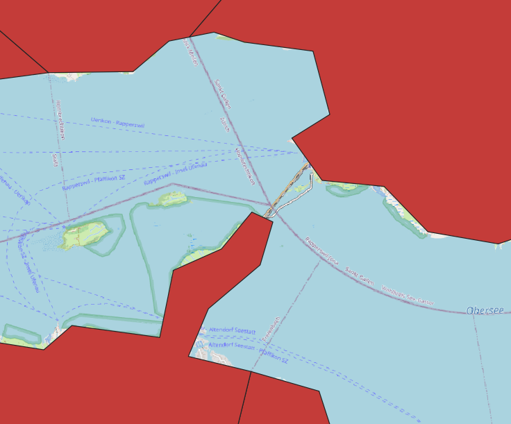
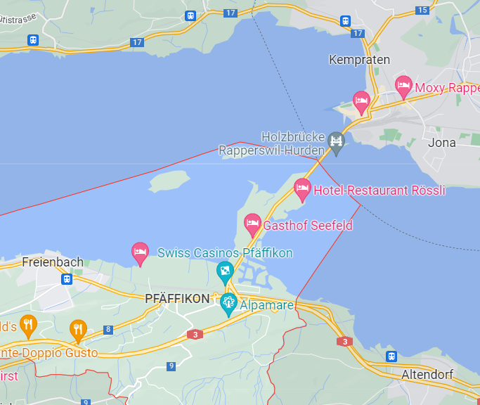
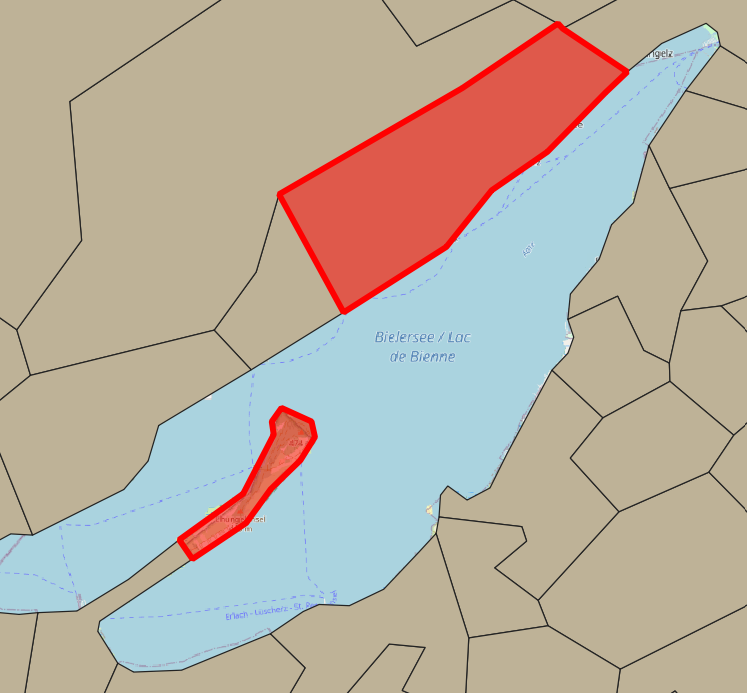

<!-- ----------------------------------------------------- -->

```{r setup, include = FALSE}
set.seed(12345)
options(scipen = 999)
options(max.print = "75")

library(pacman)
p_load(tidyverse, readxl, magrittr, 
       scales, janitor, lubridate, DT,
       spdep, sf, tmap)

tmap_options(check.and.fix = TRUE)

import::from("sjmisc", "frq")
```

```{r conflicts, include = FALSE}
tidyverse::tidyverse_conflicts()

conflicted::conflict_scout()

sf_extSoftVersion()
```

```{r knit-setup, include = FALSE}
knitr::opts_knit$set(root.dir = rprojroot::find_rstudio_root_file())

knitr::opts_chunk$set(cache = FALSE,
                      prompt = FALSE,
                      tidy = FALSE,
                      comment = NA,
                      message = FALSE,
                      warning = FALSE)

knitr::opts_knit$set(width = 75)

mu <- Hmisc::markupSpecs$html
```

<!-- ----------------------------------------------------- -->

# Data sources 

## BfS geodata 2021 {.tabset}

[Generalisierte Gemeindegrenzen: Geodaten](https://www.bfs.admin.ch/bfs/de/home/dienstleistungen/geostat/geodaten-bundesstatistik/administrative-grenzen/generalisierte-gemeindegrenzen.assetdetail.17964056.html).  

Contains three versions of data:  

> "Generalisierte Gemeindegrenzen, Stand 01.01.2021 & 18.04.2021 & 01.07.2021"	

**Using `01.07` release.**  

```{r eval=FALSE}
download.file(url = "https://www.bfs.admin.ch/bfsstatic/dam/assets/17964056/master",
              destfile = "data-raw/BfS/ag-b-00.03-875-gg21.zip",
              method = "curl")

unzip("data-raw/BfS/ag-b-00.03-875-gg21.zip", exdir = "data-raw/BfS/ag-b-00.03-875-gg21")

unlink("data-raw/BfS/ag-b-00.03-875-gg21.zip")
unlink("data-raw/BfS/ag-b-00.03-875-gg21/txt", recursive = TRUE)
unlink("data-raw/BfS/ag-b-00.03-875-gg21/kmz", recursive = TRUE)
unlink("data-raw/BfS/ag-b-00.03-875-gg21/ggg_2021-LV03", recursive = TRUE)
unlink("data-raw/BfS/ag-b-00.03-875-gg21/ggg_2021-LV95/ggg_2021-LV95.gdb", recursive = TRUE)
```

```{r include=FALSE}
gg21_orig <- 
  st_read("data-raw/BfS/ag-b-00.03-875-gg21/ggg_2021-LV95/shp/g1g21_01072021.shp",
          as_tibble = TRUE) %>% 
  st_set_crs(2056) %>% 
  st_zm(drop = TRUE, what = "ZM")
```

```{r warning=FALSE}
gg21 <- 
  st_read("data-raw/BfS/ag-b-00.03-875-gg21/ggg_2021-LV95/shp/g1g21_01072021_cor.shp",
          as_tibble = TRUE) %>% 
  st_set_crs(2056) %>% 
  st_zm(drop = TRUE, what = "ZM")

kt21 <- 
  st_read("data-raw/BfS/ag-b-00.03-875-gg21/ggg_2021-LV95/shp/g1k21.shp",
          as_tibble = TRUE) %>% 
  st_zm(drop = TRUE, what = "ZM") %>% 
  st_transform(2056)

se21 <- 
  st_read("data-raw/BfS/ag-b-00.03-875-gg21/ggg_2021-LV95/shp/g1s21.shp",
          as_tibble = TRUE) %>% 
  filter(GMDNAME != "Lago di Como") %>% 
  st_zm(drop = TRUE, what = "ZM") %>% 
  st_transform(2056)
```

```{r include=FALSE}
# unique(st_geometry_type(gg21))

table(st_is_valid(gg21))

# gg21 written after after processing
write_rds(kt21, "data/BfS/kt21.Rds")
write_rds(se21, "data/BfS/se21.Rds")

st_write(kt21, "data/geo/BfS.gpkg", 
         layer = "kt21", delete_dsn = TRUE)
st_write(se21, "data/geo/BfS.gpkg", 
         layer = "se21", append = FALSE)
```

### Canton 

```{r echo=FALSE}
tm_shape(se21, is.master = FALSE) +
  tm_fill(col = "#a7cdf2")  +
  tm_shape(kt21) +
  tm_borders()
```

### Municipality 

```{r echo=FALSE}
tm_shape(se21, is.master = FALSE) +
  tm_fill(col = "#a7cdf2")  +
  tm_shape(gg21) +
  tm_borders()
```

## BfS geodata 2022

[Generalisierte Gemeindegrenzen: Geodaten](https://www.bfs.admin.ch/bfs/en/home/services/geostat/swiss-federal-statistics-geodata/administrative-boundaries/generalized-boundaries-local-regional-authorities.assetdetail.21224783.html).  

Last update:  

> "08.02.2022"	

Might be needed to link to voting datasets.  

```{r eval=FALSE}
download.file(url = "https://www.bfs.admin.ch/bfsstatic/dam/assets/21224783/master",
              destfile = "data-raw/BfS/ag-b-00.03-875-gg22.zip",
              method = "curl")

unzip("data-raw/BfS/ag-b-00.03-875-gg22.zip", exdir = "data-raw/BfS/ag-b-00.03-875-gg22")

unlink("data-raw/BfS/ag-b-00.03-875-gg22.zip")
unlink("data-raw/BfS/ag-b-00.03-875-gg22/txt", recursive = TRUE)
unlink("data-raw/BfS/ag-b-00.03-875-gg22/kmz", recursive = TRUE)
unlink("data-raw/BfS/ag-b-00.03-875-gg22/ggg_2022_LV95/ggg_2022-LV95.gdb", recursive = TRUE)
```

```{r warning=FALSE}
gg22 <- 
  st_read("data-raw/BfS/ag-b-00.03-875-gg22/ggg_2022_LV95/shp/g1g22.shp",
          as_tibble = TRUE) %>% 
  st_set_crs(2056) %>% 
  st_zm(drop = TRUE, what = "ZM")
```

## Alternative lakes dataset

Coming from Kartengeometrien ThemaKart - Set «PRO» 2019 available [here](https://www.bfs.admin.ch/bfs/de/home/statistiken/kataloge-datenbanken/karten.assetdetail.7546178.html).  

```{r}
se21_alt <- 
  st_read("data-raw/BfS/KM04-00-c-suis-2022-q/00_TOPO/K4_seenyyyymmdd/k4seenyyyymmdd_ch2007Poly.shp",
          as_tibble = TRUE) %>% 
  st_transform(2056)
```

That adds few smaller lakes (in blue):  

```{r echo=FALSE}
tm_shape(se21_alt, is.master = TRUE) +
  tm_fill(col = "blue")  +
  tm_shape(se21) +
  tm_fill(col = "grey80")
```

```{r include=FALSE}
write_rds(se21_alt, "data/BfS/se21_alt.Rds")

st_write(se21_alt, "data/geo/BfS.gpkg", 
         layer = "se21_alt", append = FALSE)
```

## swisstopo geodata 2021

### Boundaries

`swissBOUNDARIES3D` data available from [here](https://www.swisstopo.admin.ch/de/geodata/landscape/boundaries3d.html).   

```{r eval=FALSE}
download.file(url = "https://data.geo.admin.ch/ch.swisstopo.swissboundaries3d/swissboundaries3d_2021-07/swissboundaries3d_2021-07_2056_5728.shp.zip",
              destfile = "data-raw/swisstopo/swissboundaries3d_2021-07_2056_5728.shp.zip",
              method = "curl")

unzip("data-raw/swisstopo/swissboundaries3d_2021-07_2056_5728.shp.zip", 
      exdir = "data-raw/swisstopo/swissboundaries3d_2021-07_2056_5728")

unlink("data-raw/swisstopo/swissboundaries3d_2021-01_2056_5728.shp.zip")
```

```{r}
st_gg21 <- 
  st_read("data-raw/swisstopo/swissboundaries3d_2021-07_2056_5728/SHAPEFILE_LV95_LN02/swissBOUNDARIES3D_1_3_TLM_HOHEITSGEBIET.shp",
          as_tibble = TRUE) %>% 
  st_zm(drop = TRUE, what = "ZM") %>% 
  st_transform(2056) 

st_kt21 <- 
  st_read("data-raw/swisstopo/swissboundaries3d_2021-07_2056_5728/SHAPEFILE_LV95_LN02/swissBOUNDARIES3D_1_3_TLM_KANTONSGEBIET.shp",
          as_tibble = TRUE) %>% 
  st_zm(drop = TRUE, what = "ZM") %>% 
  st_transform(2056)
```

```{r include=FALSE}
# unique(st_geometry_type(st_gg21))
# unique(st_geometry_type(st_kt21))

# st_gg written after processing
write_rds(st_kt21, "data/swisstopo/st_kt21.Rds")

st_write(st_kt21, "data/geo/swisstopo.gpkg", 
         layer = "st_kt21", delete_dsn = TRUE)
```

### Lakes 

Additional dataset of lakes was derived from `swissTLM3D_TLM_STEHENDES_GEWAESSER.shp` layer from `swissTLM3D` [dataset](https://www.swisstopo.admin.ch/de/geodata/landscape/tlm3d.html).  

```{r eval=FALSE}
# convert lines to polygons, calculate area

# testing is good here:
# "NAME" = 'Bodensee | Lac de Constance | Lago di Costanza | Lai da Constanza'

st_se21 <- 
  st_read("data-raw/swisstopo/swisstlm3d_2021-04_2056_5728.shp/swissTLM3D_TLM_STEHENDES_GEWAESSER.shp",
          as_tibble = TRUE) %>% 
  st_zm(drop = TRUE, what = "ZM") %>% 
  filter(OBJEKTART == "See") %>% 
  group_by(GEW_LAUF_U) %>% 
  summarise(geometry = st_combine(geometry),
            NAME = first(NAME),
            OBJEKTART = first(OBJEKTART)) %>%
  st_cast("MULTILINESTRING") %>% 
  st_polygonize() %>%
  mutate(area = st_area(.)) %>% 
  ungroup() %>% 
  relocate(geometry, .after = last_col())

st_see21_insel <- 
  st_read("data-raw/swisstopo/swisstlm3d_2021-04_2056_5728.shp/swissTLM3D_TLM_STEHENDES_GEWAESSER.shp",
          as_tibble = TRUE) %>% 
  st_zm(drop = TRUE, what = "ZM") %>% 
  filter(OBJEKTART == "Seeinsel") %>% 
  group_by(GEW_LAUF_U) %>% 
  summarise(geometry = st_combine(geometry),
            NAME = first(NAME),
            OBJEKTART = first(OBJEKTART)) %>%
  st_cast("MULTILINESTRING") %>% 
  st_polygonize() %>% 
  mutate(area = st_area(.)) %>% 
  ungroup() %>% 
  relocate(geometry, .after = last_col())

st_se21 <- 
  st_difference(st_se21, st_union(st_see21_insel)) %>% 
  st_collection_extract("POLYGON") %>% 
  st_zm(drop = TRUE, what = "ZM") %>% 
  st_transform(2056)

unique(st_geometry_type(st_se21))

frq(st_is_valid(st_se21))

summary(st_se21$area)

plot(st_se21[, 2])

rm(st_see21_insel); gc()
```

```{r eval=FALSE, include=FALSE}
# st_write(st_se21, "data/swisstopo/st_se21.gpkg", layer = "lakes", delete_dsn = TRUE)
# st_write(st_see21_insel, "data/swisstopo/st_se21.gpkg", layer = "st_see21_insel", append = FALSE)

write_rds(st_se21, "data/swisstopo/st_se21.Rds") 

st_write(st_se21, "data/geo/swisstopo.gpkg", 
         layer = "st_se21", append = FALSE)

st_se21_sel <- st_se21 %>% 
  st_filter(se21_alt)

write_rds(st_se21_sel, "data/swisstopo/st_se21_sel.Rds") 

st_write(st_se21_sel, "data/geo/swisstopo.gpkg", 
         layer = "st_se21_sel", append = FALSE)
```

### Combined 

```{r include=FALSE}
st_se21_sel <- read_rds("data/swisstopo/st_se21_sel.Rds") 
```

Lakes dataset (selecting only `r nrow(se21_alt)` largest features from ThemaKart dataset overlap!) was then used to erase area of municipalities that extends over lakes. Issue is described in [#48](https://github.com/RPanczak/ISPM_geo-mortality/issues/48).  

```{r warning=FALSE}
st_gg21 <- 
  st_difference(st_gg21, st_union(st_se21_sel)) %>% 
  # small slivers of lakes left
  filter(OBJEKTART != "Kantonsgebiet") %>% 
  st_collection_extract("POLYGON") %>% 
  st_zm(drop = TRUE, what = "ZM") %>% 
  st_transform(2056) # %>% 
  # group_by(BFS_NUMMER) %<>% 
  # summarise(BFS_NUMMER = first(BFS_NUMMER),
  #           NAME = first(NAME),
  #           GEM_TEIL = max(GEM_TEIL)) %>%
  # st_cast("MULTIPOLYGON") 
```

```{r eval=FALSE, include=FALSE}
unique(st_geometry_type(st_gg21))

# if needed as POLYGON (not MULTI)
# remove st_collection_extract() above
# and run this one

temp <- rbind(
  st_gg21 %>%
    filter(st_is(geometry, "POLYGON")),
  
  st_gg21 %>%
    filter(st_is(geometry, "MULTIPOLYGON")) %>% 
    st_cast("POLYGON")
)

unique(st_geometry_type(temp))
```

## swisstopo geodata 2022

2022 boundaries might be needed to link to voting patterns.  

```{r eval=FALSE}
download.file(url = "https://data.geo.admin.ch/ch.swisstopo.swissboundaries3d/swissboundaries3d_2022-01/swissboundaries3d_2022-01_2056_5728.shp.zip",
              destfile = "data-raw/swisstopo/swissboundaries3d_2022-01_2056_5728.shp.zip",
              method = "curl")

unzip("data-raw/swisstopo/swissboundaries3d_2022-01_2056_5728.shp.zip", 
      exdir = "data-raw/swisstopo/swissboundaries3d_2022-01_2056_5728")

unlink("data-raw/swisstopo/swissboundaries3d_2022-01_2056_5728.shp.zip")
```

```{r}
st_gg22 <- 
  st_read("data-raw/swisstopo/swissboundaries3d_2022-01_2056_5728/SHAPEFILE_LV95_LN02/swissBOUNDARIES3D_1_3_TLM_HOHEITSGEBIET.shp",
          as_tibble = TRUE) %>% 
  st_zm(drop = TRUE, what = "ZM") %>% 
  st_transform(2056) 
```

```{r include=FALSE}
# st_gg22 %>%
#   st_drop_geometry() %>%
#   filter(BFS_NUMMER %in% c(2391, 5391, 5394)) %>%
#   select(BFS_NUMMER, NAME)

st_gg22 <- 
  st_difference(st_gg22, st_union(st_se21_sel)) %>% 
  # small slivers of lakes left
  filter(OBJEKTART != "Kantonsgebiet") %>% 
  st_collection_extract("POLYGON") %>% 
  st_zm(drop = TRUE, what = "ZM") %>% 
  st_transform(2056) # %>% 
  # group_by(BFS_NUMMER) %>% 
  # summarise(BFS_NUMMER = first(BFS_NUMMER),
  #           NAME = first(NAME),
  #           GEM_TEIL = max(GEM_TEIL)) %>%
  # st_cast("MULTIPOLYGON") 

st_gg22 %<>% 
  filter(! BFS_NUMMER %in% c(2391, 5391, 5394)) %>% 
  # exclude lakes
  filter(OBJEKTART != "Kantonsgebiet") %>% 
  # exclude FL & enclaves
  filter(ICC == "CH") %>% 
  select(BFS_NUMMER, NAME, KANTONSNUM, GEM_TEIL) %>% 
  rename(GMDNR = BFS_NUMMER,
         GMDNAME = NAME,
         KTNR = KANTONSNUM) %>% 
  arrange(GMDNR)

# unique(st_geometry_type(st_gg22))
# length(unique(st_gg22$GMDNR))

write_rds(st_gg22, "data/swisstopo/st_gg22.Rds")
```

## Important differences

### Resolution

swisstopo files (in blue below) are larger in size (and slower to plot) but offer better resolution and will be used for certain spatial operations (like linking to SEP) whereas BfS data (in red) are smaller in size and faster to plot. Example of municipality Bern:  

```{r echo=FALSE}
tm_shape(st_gg21 %>% filter(BFS_NUMMER == 351)) +
  tm_borders(col = "blue", lwd = 1, alpha = 0.5) +
  tm_shape(gg21 %>% filter(GMDNR == 351)) +
  tm_borders(col = "red", lwd = 2, alpha = 0.5) +
  tm_layout(
    title = "Different spatial resolutions"
  )
```

### Multipart features

BfS originally stores data as `MULTIPOLYGON`. In such case municipality split over several disconnected areas is stored as *single record*. Example of municipality Monthey which consists of four separate areas:  

```{r echo=FALSE}
gg21 %>% 
  filter(GMDNR == 6153) %>% 
  mutate(GEM_TEIL = "1") %>% 
  select(GEM_TEIL) %>% 
  plot()
```

```{r eval=FALSE, warning=FALSE, include=FALSE}
# if polygons are needed
gg21 %>%
  filter(GMDNR == 6153) %>%
  st_cast("POLYGON")
```

The same municipality in swisstopo data is stored as **set of** `MULTIPOLYGON` types and is represented by *four separate records* instead of one.  

```{r echo=FALSE}
st_gg21 %>% 
  filter(BFS_NUMMER == 6153) %>%
  select(GEM_TEIL, geometry) %>% 
  plot()
```

That might have some implications in terms of spatial operations (maybe contiguity too?). Data can easily be converted between types if needed. 

### 2021 vs 2022 boundaries

Slightly less municipalities:  

```{r}
length(unique(st_gg21$BFS_NUMMER))
length(unique(st_gg22$GMDNR))
```

In 2021 but not in 2022:  

```{r echo=FALSE}
st_gg21 %>% 
  st_drop_geometry() %>% 
  select(BFS_NUMMER, NAME) %>% 
  rename(GMDNR = BFS_NUMMER) %>% 
  anti_join(st_drop_geometry(st_gg22)) %>% 
  arrange(GMDNR) %>% 
  datatable()
```

Vice versa:  

```{r echo=FALSE}
st_gg22 %>% 
  st_drop_geometry() %>% 
  select(GMDNR, GMDNAME) %>% 
  rename(BFS_NUMMER = GMDNR) %>% 
  anti_join(st_drop_geometry(st_gg21)) %>% 
  arrange(BFS_NUMMER) %>% 
  datatable()
```

<!-- ----------------------------------------------------- -->

# Municipality boundaries preparations

## Disconnected boundaries - Lake Lugano

Two communities in TI *Bissone* & *Melide* are disconnected by Lake Lugano in BfS municipality data:


In reality communities are indeed connected:


That has been manually corrected in GIS and now looks like:


Importance of this issue is covered [here](https://doi.org/10.1016/j.sste.2018.04.002).  

## Disconnected boundaries - Lake Zurich

Freienbach & Rapperswil-Jona are disconnected on the map of boundaries:   



... but connected IRL:  


That has been fixed manually in GIS.  

## Spurious connection

Community of Twann-Tüscherz (in red) is connected to Erlach via small part of the St. Peter's Island.  


This connection has been removed.  

## Non-residential municipalities

Excluding municipalities without residents:  

- `Staatswald Galm`  
- `Comunanza Cadenazzo/Monteceneri`  
- `Comunanza Capriasca/Lugano`  

We should not expect any cases there!  

```{r eval=FALSE, include=FALSE}
gg21 %>% 
  st_drop_geometry() %>% 
  filter(GMDNR %in% c(2391, 5391, 5394)) %>% 
  select(GMDNR, GMDNAME)
```

```{r include=FALSE}
gg21 %<>% 
  filter(! GMDNR %in% c(2391, 5391, 5394)) %>% 
  select(GMDNR, GMDNAME, KTNR) %>% 
  arrange(GMDNR)

# st_gg21 %>% 
#   st_drop_geometry() %>% 
#   filter(BFS_NUMMER %in% c(2391, 5391, 5394)) %>% 
#   select(BFS_NUMMER, NAME)

st_gg21 %<>% 
  filter(! BFS_NUMMER %in% c(2391, 5391, 5394)) %>% 
  # exclude lakes
  filter(OBJEKTART != "Kantonsgebiet") %>% 
  # exclude FL & enclaves
  filter(ICC == "CH") %>% 
  select(BFS_NUMMER, NAME, KANTONSNUM, GEM_TEIL) %>% 
  rename(GMDNR = BFS_NUMMER,
         GMDNAME = NAME,
         KTNR = KANTONSNUM) %>% 
  arrange(GMDNR)
```

```{r echo=FALSE, include=FALSE}
# should be exact overlap
stopifnot(
  gg21 %>%
    filter(! GMDNR %in% st_gg21$GMDNR) %>% 
    nrow() == 0
)

stopifnot(
  st_gg21 %>%
    filter(! GMDNR %in% gg21$GMDNR) %>% 
    nrow() == 0
)
```

<!-- ----------------------------------------------------- -->

# Labour market areas 2018

## Data sources 

More info [here](https://www.bfs.admin.ch/bfs/de/home/aktuell/neue-veroeffentlichungen.gnpdetail.2019-0439.html).  

```{r}
raum <- read_xlsx("data-raw/BfS/Raumgliederungen.xlsx", 
                  skip = 1) %>% 
  remove_empty(c("rows", "cols")) %>% clean_names() %>% 
  filter(! is.na(bfs_gde_nummer)) %>% 
  select(-bezirksname) %>% 
  rename(GMDNR = bfs_gde_nummer,
         GMDNAME = gemeindename,
         KTNAME = kanton,
         ARGRNR = arbeitsmarktgrossregionen_2018,
         ARNR = arbeitsmarktregionen_2018) %>% 
  select(GMDNR, GMDNAME,
         KTNAME, 
         ARGRNR, ARNR) %>% 
  left_join(
    read_xlsx("data-raw/BfS/Raumgliederungen.xlsx", 
              skip = 1, sheet = "CH1+CL_GBAE+2018.0") %>% 
      rename(
        ARGRNR = Code,
        ARGRNAME = Label)
  ) %>% 
  left_join(
    read_xlsx("data-raw/BfS/Raumgliederungen.xlsx", 
              skip = 1, sheet = "CH1+CL_BAE+2018.0") %>% 
      rename(
        ARNR = Code,
        ARNAME = Label) %>% 
      # weird hyphen in some neames?
      mutate(ARNAME = str_replace(ARNAME, fixed("–"), "-"))
  ) %>% 
  relocate(ARGRNAME, .after = ARGRNR) %>% 
  relocate(ARNAME, .after = ARNR) %>% 
  mutate(border = if_else(ARNAME %in% c("Schaffhausen", "Basel", 
                                        "Delémont", "Porrentruy", "Saignelégier–Le Noirmont", "La Chaux-de-Fonds",
                                        "Le Chenit", "Genève",
                                        "Locarno", "Lugano"), 
                          1, 0))
```

```{r include=FALSE}
write_rds(raum, "data/BfS/raum.Rds")
```

Number of municipalities that are located within border labour market areas:  

```{r echo=FALSE}
frq(raum, border)
```

## Preps

List of regions was merged on the basis of municipality number and then these municipalities were aggregated.  

```{r eval=FALSE}
argr21 <- gg21 %>% 
  left_join(raum) %>% 
  group_by(ARGRNR) %>% 
  summarise(ARGRNR = first(ARGRNR),
            ARGRNAME = first(ARGRNAME)) %>%
  st_cast("MULTIPOLYGON") 

ar21 <- gg21 %>% 
  left_join(raum) %>% 
  group_by(ARNR) %>% 
  summarise(ARNR = first(ARNR),
            ARNAME = first(ARNAME),
            border = first(border)) %>%
  st_cast("MULTIPOLYGON")
```

Dissolving of BfS data via R was not perfect and manual corrections were implemented in QGIS software.  

```{r eval=FALSE, include=FALSE}
# corrected manually in GIS so do not overwirte! 
# st_write(argr21, "data/geo/argr_21_cor.shp", delete_dsn = TRUE)
# st_write(ar21, "data/geo/ar_21_cor.shp", delete_dsn = TRUE)
```

```{r}
argr21 <- st_read("data/geo/argr_21_cor.shp") %>% 
  select(-ARGRNAME) %>% 
  left_join(raum %>% select(ARGRNR, ARGRNAME)) %>% 
  group_by(ARGRNR) %>% 
  summarise(ARGRNR = first(ARGRNR),
            ARGRNAME = first(ARGRNAME)) %>%
  st_cast("MULTIPOLYGON") 

ar21 <- st_read("data/geo/ar_21_cor.shp") %>% 
  select(-ARNAME) %>% 
  left_join(raum %>% select(ARNR, ARNAME, border)) %>% 
  group_by(ARNR) %>% 
  summarise(ARNR = first(ARNR),
            ARNAME = first(ARNAME),
            border = first(border)) %>%
  st_cast("MULTIPOLYGON")
```

```{r echo=FALSE, include=FALSE}
# unique(st_geometry_type(argr21))
# unique(st_geometry_type(ar21))

# table(st_is_valid(argr21))
# table(st_is_valid(ar21))

write_rds(argr21, "data/BfS/argr21.Rds")
write_rds(ar21, "data/BfS/ar21.Rds")

st_write(argr21, "data/geo/BfS.gpkg", 
         layer = "argr21", append = FALSE)
st_write(ar21, "data/geo/BfS.gpkg", 
         layer = "ar21", append = FALSE)
```

Dissolve in R using swisstopo data was all fine.  

```{r}
# same for swisstopo
# removing '-' from names which causes problems with writing shp
st_argr21 <- st_gg21 %>% 
  left_join(raum) %>% 
  group_by(ARGRNR) %>% 
  summarise(ARGRNR = first(ARGRNR),
            ARGRNAME = first(ARGRNAME)) %>%
  st_cast("MULTIPOLYGON") %>% 
  mutate(ARGRNAME = str_replace_all(ARGRNAME, "–", " "))

st_ar21 <- st_gg21 %>% 
  left_join(raum) %>% 
  group_by(ARNR) %>% 
  summarise(ARNR = first(ARNR),
            ARNAME = first(ARNAME),
            border = first(border)) %>%
  st_cast("MULTIPOLYGON") %>% 
  mutate(ARNAME = str_replace_all(ARNAME, "–", " "))
```

```{r include=FALSE}
st_write(st_argr21, "data/geo/swisstopo.gpkg", 
         layer = "st_argr21", append = FALSE)
st_write(st_ar21, "data/geo/swisstopo.gpkg", 
         layer = "st_ar21", append = FALSE)

write_rds(st_argr21, "data/swisstopo/st_argr21.Rds")
write_rds(st_ar21, "data/swisstopo/st_ar21.Rds")
```

```{r eval=FALSE, include=FALSE}
p_load(cleangeo)

sp <- rgdal::readOGR("data/geo/st_ar_21.shp")

sp.report <- clgeo_CollectionReport(sp)
sp.summary <- clgeo_SummaryReport(sp.report)
sp.fixed <- clgeo_Clean(sp, verbose = TRUE)

map_centre <- st_sfc(st_point(c(2717542, 1090036)), crs = 2056) %>% 
  st_as_sf()

map_centre_b <- map_centre %>% 
  st_buffer(10000) %>% 
  st_as_sf()

tmap_mode("plot")
tm_shape(map_centre_b) +
  tm_borders(col = "blue", lwd = 1, alpha = 0.5) +
  tm_shape(map_centre) +
  tm_symbols() +
  tm_shape(ar21_cor) +
  tm_borders(col = "red", lwd = 2, alpha = 0.5) 

tmap_mode("plot")
tm_shape(map_centre) +
  tm_borders(col = "blue", lwd = 1, alpha = 0.5) +
  tm_shape(ar21_cor) +
  tm_borders(col = "red", lwd = 2, alpha = 0.5) 


rm(sp, sp.report, sp.summary, sp.fixed, map_centre, map_centre_b); gc()
p_unload(cleangeo)
```

```{r echo=FALSE}
tm_shape(se21, is.master = FALSE) +
  tm_fill(col = "lightskyblue", alpha = 0.5) +
  tm_shape(ar21, is.master = TRUE) +
  tm_borders(col = "darkgray", lwd = 1, alpha = 0.5) +
  tm_shape(argr21) +
  tm_borders(col = "darkorchid", lwd = 2, alpha = 0.5) +
  tm_layout(
    title = "Labour market regions 2021"
  )
```

```{r eval=FALSE, include=FALSE}
# same but swisstopo based
tm_shape(st_se21_sel, is.master = FALSE) +
  tm_fill(col = "lightskyblue", alpha = 0.5) +
  tm_shape(st_ar21, is.master = TRUE) +
  tm_borders(col = "darkgray", lwd = 1, alpha = 0.5) +
  tm_shape(st_argr21) +
  tm_borders(col = "darkorchid", lwd = 2, alpha = 0.5) +
  tm_layout(
    title = "Labour market regions 2021"
  )
```

## Border regions

Defined on the basis of [this map](https://www.bfs.admin.ch/bfs/de/home/aktuell/neue-veroeffentlichungen.assetdetail.8706500.html). Linked by name of the region since some codes seemed to be out of date? (ie. Basel).  


```{r echo=FALSE}
tm_shape(se21, is.master = FALSE) +
  tm_fill(col = "lightskyblue", alpha = 0.5) +
  tm_shape(ar21 %>% mutate(border = factor(border))) +
  tm_fill(col = "border", lwd = 2, alpha = 0.66, 
          palette = "Set2", n = 2,
          legend.show = FALSE) +
  tm_shape(ar21) +
  tm_borders(col = "white") +
  tm_layout(
    title = "Border regions 2021"
  )
```

```{r echo=FALSE}
ar21 %>% 
  st_drop_geometry() %>% 
  filter(border == 1) %>%  
  select(-border) %>% 
  datatable() 
```

The same typology can be applied to municipalities:  

```{r echo=FALSE}
tm_shape(se21, is.master = FALSE) +
  tm_fill(col = "lightskyblue", alpha = 0.5) +
  tm_shape(gg21 %>% left_join(raum) %>% mutate(border = factor(border))) +
  tm_fill(col = "border", lwd = 2, alpha = 0.66, palette = "Set2", n = 2,
          legend.show = FALSE) +
  tm_shape(gg21) +
  tm_borders(col = "white") +
  tm_layout(
    title = "Border municipalities 2021"
  )
```

```{r echo=FALSE}
gg21 %>% 
  st_drop_geometry() %>% 
  left_join(raum) %>% 
  filter(border == 1) %>%  
  select(GMDNAME, ARGRNAME, ARNAME) %>% 
  datatable() 
```

```{r}
gg21 %>% left_join(raum %>% select(GMDNR, KTNAME, 
                                   ARGRNR, ARGRNAME, ARNR, ARNAME,
                                   border)) %>% 
  relocate(geometry, .after = last_col()) %>% 
  write_rds("data/BfS/gg21.Rds")

gg21 %>% left_join(raum %>% select(GMDNR, KTNAME, 
                                   ARGRNR, ARGRNAME, ARNR, ARNAME,
                                   border)) %>% 
  relocate(geometry, .after = last_col()) %>%
  st_write("data/geo/BfS.gpkg", 
           layer = "gg21", append = FALSE)

st_gg21 %>% left_join(raum %>% select(GMDNR, KTNAME, 
                                      ARGRNR, ARGRNAME, ARNR, ARNAME,
                                      border)) %>% 
  relocate(geometry, .after = last_col()) %>% 
  write_rds("data/swisstopo/st_gg21.Rds")

st_gg21 %>% left_join(raum %>% select(GMDNR, KTNAME, 
                                      ARGRNR, ARGRNAME, ARNR, ARNAME,
                                      border)) %>% 
  relocate(geometry, .after = last_col()) %>% 
  st_write("data/geo/swisstopo.gpkg", 
           layer = "st_gg21", append = FALSE)
```

<!-- ----------------------------------------------------- -->

# tg3o simplification

## Data 

So called 'productive areas', also coming from BfS' *ThemaKart* [product](https://www.bfs.admin.ch/bfs/en/home/statistics/regional-statistics/base-maps/cartographic-bases.assetdetail.21245514.html).  

Roughly coincides with removing areas of above 2000m asl.  

```{r include=FALSE, results=FALSE}
tg3o_orig <- 
  st_read("data-raw/BfS/KM04-00-c-suis-2022-q/01_INST/Vegetationsfläche_vf/K4_polg20210101_vf/K4polg20210101gf_ch2007Poly.shp",
          as_tibble = TRUE) %>% 
  st_transform(2056) %>% 
  rename(GMDNR = id,
         GMDNAME = name)
```

```{r results=FALSE}
tg3o <- 
  st_read("data-raw/BfS/KM04-00-c-suis-2022-q/01_INST/Vegetationsfläche_vf/K4_polg20210101_vf/K4polg20210101gf_ch2007Poly_cor.shp",
          as_tibble = TRUE) %>% 
  st_transform(2056) %>% 
  rename(GMDNR = id,
         GMDNAME = name)
```

```{r eval=FALSE, include=FALSE}
tg3o %>% 
  st_drop_geometry() %>% 
  filter(GMDNR %in% c(2391, 5391, 5394)) %>% 
  select(GMDNR, GMDNAME)

tg3o %<>% 
  filter(! GMDNR %in% c(2391, 5391, 5394)) %>% 
  select(GMDNR, GMDNAME, KTNR) %>% 
  arrange(GMDNR)
```

```{r echo=FALSE}
qtm(tg3o)
```

Dataset consists of `r scales::number(length(unique(tg3o$GMDNR)), big.mark = ",")` communities. The state is from `2021-01-01` so needs to be updated to July to match the mortality of the data.  

## Updating to Jul 2021

Using `Gemeindestand - Stand vom 01.07.2021.xlsx` from [here](https://www.agvchapp.bfs.admin.ch/de/home) we can identify municipalities with changes during the study period.  

```{r}
histcomm <- read_xlsx("data-raw/BfS/Mutierte_Gemeinden_20150101_bis_20210701.xlsx", 
                      col_types = c("numeric", "text", "numeric", 
                                    "numeric", "text", "text", "numeric", 
                                    "numeric", "text", "text"), 
                      skip = 1) %>%
  remove_empty(c("rows", "cols")) %>% clean_names() %>% 
  mutate(datum_der_aufnahme = ymd(datum_der_aufnahme)) %>% 
  arrange(desc(datum_der_aufnahme), gemeindename_5) %>% 
  rename(kanton_old = kanton_2,
         bezirks_num_old = bezirks_nummer_3,
         bfs_gde_num_old = bfs_gde_nummer_4,
         gemeindename_old = gemeindename_5,
         kanton_new = kanton_6,
         bezirks_num_new = bezirks_nummer_7,
         bfs_gde_num_new = bfs_gde_nummer_8,
         gemeindename_new = gemeindename_9) %>% 
  select(-bezirks_num_old, -bezirks_num_new)
```

```{r include=FALSE}
write_rds(histcomm, "data/BfS/histcomm.Rds")
```

<!-- There were `r length(unique(histcomm$bezirks_num_old))` municipalities with changes recorded in `2015-01-01` - `2021-07-01` period.   -->

The following changes occurred after `2020-01-01` onwards that need to be replicated in tg3o dataset:  

```{r echo=FALSE}
histcomm %>% 
  filter(datum_der_aufnahme > ymd("2021-01-01")) %>% 
  select(-kanton_new) %>% 
  arrange(bfs_gde_num_new, gemeindename_new) %>% 
  datatable(options = list(pageLength = 11))
```

```{r eval=FALSE, include=FALSE}
# Auf den 18. April 2021 fusionierten die ehemaligen politischen Gemeinden Croglio, Monteggio, Ponte Tresa und Sessa zur neuen politischen Gemeinde Tresa

histcomm %>% 
  filter(bfs_gde_num_new %in% c(5239)) %>% 
  select(bfs_gde_num_new, gemeindename_new, 
         bfs_gde_num_old, gemeindename_old)

histcomm %>% 
  filter(bfs_gde_num_old %in% c(5178, 5202, 5213, 5222)) %>% 
  select(bfs_gde_num_new, gemeindename_new, 
         bfs_gde_num_old, gemeindename_old)

gg21 %>% 
  st_drop_geometry() %>% 
  filter(GMDNR %in% c(5239)) %>% 
  select(GMDNR, GMDNAME)

st_read("data-raw/BfS/ag-b-00.03-875-gg21/ggg_2021-LV95/shp/g1g21_01012021.shp",
        quiet = TRUE) %>%
  st_drop_geometry() %>%
  filter(GMDNR %in% c(5178, 5202, 5213, 5222)) %>%
  select(GMDNR, GMDNAME)
```

```{r}
changes <- histcomm %>% 
  filter(datum_der_aufnahme > ymd("2021-01-01")) %>% 
  select(bfs_gde_num_old, bfs_gde_num_new, gemeindename_new)

tg3o %<>% 
  left_join(changes, by = c("GMDNR" = "bfs_gde_num_old")) %>% 
  mutate(GMDNR = if_else(!is.na(bfs_gde_num_new), 
                         bfs_gde_num_new, GMDNR),
         GMDNAME = if_else(!is.na(bfs_gde_num_new), 
                           gemeindename_new, GMDNAME)) %>% 
  select(-bfs_gde_num_new, -gemeindename_new) %>% 
  group_by(GMDNR) %>% 
  summarise(GMDNR = first(GMDNR),
            GMDNAME = first(GMDNAME)) %>%
  st_cast("MULTIPOLYGON") %>% 
  ungroup()
```

```{r message=FALSE, warning=FALSE, include=FALSE}
# original dataset as it came from BfS
frq(st_is_valid(tg3o_orig))

gc() 

tg3o_orig %<>% 
  left_join(changes, by = c("GMDNR" = "bfs_gde_num_old")) %>% 
  mutate(GMDNR = if_else(!is.na(bfs_gde_num_new), 
                         bfs_gde_num_new, GMDNR),
         GMDNAME = if_else(!is.na(bfs_gde_num_new), 
                           gemeindename_new, GMDNAME)) %>% 
  select(-bfs_gde_num_new, -gemeindename_new) %>% 
  group_by(GMDNR) %>% 
  summarise(GMDNR = first(GMDNR),
            GMDNAME = first(GMDNAME)) %>%
  st_cast("MULTIPOLYGON") %>% 
  ungroup()

frq(st_is_valid(tg3o_orig))

# manually corrected dataset forcing new connections
tg3o_nb <- 
  st_read("data-raw/BfS/KM04-00-c-suis-2022-q/01_INST/Vegetationsfläche_vf/K4_polg20210101_vf/K4polg20210101gf_ch2007Poly_cor_nb.shp",
          as_tibble = TRUE) %>% 
  st_transform(2056) %>% 
  rename(GMDNR = id,
         GMDNAME = name)

frq(st_is_valid(tg3o_nb))

# tg3o_nb %>% 
#   filter(!st_is_valid(.)) %>% 
#   select(GMDNAME)

# fixing with this
# tg3o_nb <- st_make_valid(tg3o_nb)
# frq(st_is_valid(tg3o_nb))

gc() 

tg3o_nb %<>% 
  left_join(changes, by = c("GMDNR" = "bfs_gde_num_old")) %>% 
  mutate(GMDNR = if_else(!is.na(bfs_gde_num_new), 
                         bfs_gde_num_new, GMDNR),
         GMDNAME = if_else(!is.na(bfs_gde_num_new), 
                           gemeindename_new, GMDNAME)) %>% 
  select(-bfs_gde_num_new, -gemeindename_new) %>% 
  group_by(GMDNR) %>% 
  summarise(GMDNR = first(GMDNR),
            GMDNAME = first(GMDNAME)) %>%
  st_cast("MULTIPOLYGON") %>% 
  ungroup()

frq(st_is_valid(tg3o_nb))

# View(st_drop_geometry(tg3o))
rm(changes); gc()
```

```{r eval=FALSE}
tg3o %>% 
  st_drop_geometry() %>% 
  select(GMDNR) %>% 
  anti_join(gg21 %>% st_drop_geometry())
```

Dataset now consists of `r scales::number(length(unique(tg3o$GMDNR)), big.mark = ",")` municipalities.

## AR 

Merging to get AR in tg3o layout.  

```{r include=FALSE}
tg3o_ar <- tg3o %>% 
  left_join(raum %>% select(-GMDNAME), 
            by = c("GMDNR")) %>% 
  group_by(ARNR) %>% 
  summarise(ARNR = first(ARNR),
            ARNAME = first(ARNAME),
            border = first(border)) %>%
  st_cast("MULTIPOLYGON") %>% 
  ungroup()
```

```{r include=FALSE}
frq(st_is_valid(tg3o_ar))

tg3o_ar %>% 
  st_drop_geometry() %>% 
  select(ARNR) %>% 
  anti_join(ar21 %>% st_drop_geometry())
```

```{r echo=FALSE}
qtm(tg3o_ar)
```

```{r include=FALSE}
write_rds(tg3o, "data/geo/tg3o.Rds")
# write_rds(tg3o_orig, "data/geo/tg3o_orig.Rds")
write_rds(tg3o_ar, "data/geo/tg3o_ar.Rds")

st_write(tg3o_orig, "data/geo/tg3o.gpkg", 
         layer = "tg3o_orig", delete_dsn = TRUE)

st_write(tg3o, "data/geo/tg3o.gpkg", 
         layer = "tg3o", append = FALSE)

st_write(tg3o_ar, "data/geo/tg3o.gpkg", 
         layer = "tg3o_ar", append = FALSE)
```

<!-- ----------------------------------------------------- -->

# Spatial connectivity of municipalities

## Traditional 

Based on queen connectivity between the areas. Uses 'normal' municipality boundaries and connects them irrespectively of mountains.  

```{r eval=FALSE, include=FALSE}
# results will differ if not multipart!
# gg21 %<>%
#   st_cast("POLYGON")
```

### Weights 

```{r}
gg21_wm_q <- poly2nb(gg21, queen = TRUE, row.names = gg21$GMDNR)

gg21_wm_q
summary(gg21_wm_q)

write_rds(gg21_wm_q, "data/nb/gg21_wm_q.Rds")
```

### Region with one neighbour

`2271 Meyriez`  

```{r echo=FALSE}
tmap_mode("view")

tm_shape(gg21 %>% st_join(gg21 %>% 
                            filter(GMDNAME == "Meyriez"), 
                          left = FALSE)) +
  tm_borders(col = "blue", lwd = 1, alpha = 0.5) +
  tm_shape(gg21 %>% 
             filter(GMDNAME == "Meyriez")) +
  tm_fill(col = "red", lwd = 2, alpha = 0.5)
```

### Region with twelve neighbours (max case)

`5586 Lausanne`  

```{r echo=FALSE}
tm_shape(gg21 %>% st_join(gg21 %>% 
                            filter(GMDNAME == "Lausanne"), 
                          left = FALSE)) +
  tm_borders(col = "blue", lwd = 1, alpha = 0.5) +
  tm_shape(gg21 %>% 
             filter(GMDNAME == "Lausanne")) +
  tm_fill(col = "red", lwd = 2, alpha = 0.5)
```

### Multipart features

<!-- `6153 Monthey`   -->

```{r eval=FALSE, include=FALSE}
tm_shape(gg21 %>% st_join(gg21 %>% 
                            filter(GMDNAME == "Monthey"), 
                          left = FALSE)) +
  tm_borders(col = "grey50", lwd = 1, alpha = 0.5) +
  tm_shape(gg21 %>% 
             filter(GMDNAME == "Monthey")) + 
  tm_fill(col = "red", lwd = 2, alpha = 0.5)

temp1 <- gg21 %>% 
  st_join(gg21 %>% 
            filter(GMDNAME == "Monthey"), 
          left = FALSE) %>% 
  as_Spatial()

temp2 <- gg21 %>% 
  filter(GMDNAME == "Monthey") %>% 
  as_Spatial()

plot(temp1, col = "lightgrey") 
plot(temp2, col = "purple", add = TRUE) 
plot(gg21_wm_q, 
     coordinates(as_Spatial(gg21)), 
     pch = 19, cex = 0.6, add = TRUE, col = "red")
```

<!-- `2054 Estavayer`   -->

```{r eval=FALSE, include=FALSE}
tm_shape(gg21 %>% st_join(gg21 %>% 
                            filter(GMDNAME == "Estavayer"), 
                          left = FALSE)) +
  tm_borders(col = "grey50", lwd = 1, alpha = 0.5) +
  tm_shape(gg21 %>% 
             filter(GMDNAME == "Estavayer")) + 
  tm_fill(col = "red", lwd = 2, alpha = 0.5)

temp1 <- gg21 %>% 
  st_join(gg21 %>% 
            filter(GMDNAME == "Estavayer"), 
          left = FALSE) %>% 
  as_Spatial()

temp2 <- gg21 %>% 
  filter(GMDNAME == "Estavayer") %>% 
  as_Spatial()

plot(temp1, col = "lightgrey") 
plot(temp2, col = "purple", add = TRUE) 
plot(gg21_wm_q, 
     coordinates(as_Spatial(gg21)), 
     pch = 19, cex = 0.6, add = TRUE, col = "red")
```

Example of `418 Oberburg`. Location:  

```{r echo=FALSE}
tm_shape(gg21 %>% st_join(gg21 %>% 
                            filter(GMDNAME == "Oberburg"), 
                          left = FALSE)) +
  tm_borders(col = "grey50", lwd = 1, alpha = 0.5) +
  tm_shape(gg21 %>% 
             filter(GMDNAME == "Oberburg")) + 
  tm_fill(col = "red", lwd = 2, alpha = 0.5)
```

Connectivity:  

```{r echo=FALSE}
temp1 <- gg21 %>% 
  st_join(gg21 %>% 
            filter(GMDNAME == "Oberburg"), 
          left = FALSE) %>% 
  as_Spatial()

temp2 <- gg21 %>% 
  filter(GMDNAME == "Oberburg") %>% 
  as_Spatial()

plot(temp1, col = "lightgrey") 
plot(temp2, col = "purple", add = TRUE) 
plot(gg21_wm_q, 
     coordinates(as_Spatial(gg21)), 
     pch = 19, cex = 0.6, add = TRUE, col = "red")
```

### Connectivity over Zurichsee

`1322 Freienbach` fixed above:  

```{r echo=FALSE}
tm_shape(gg21_orig %>% 
           filter(GMDNAME %in% c("Freienbach", "Rapperswil-Jona"))) +
  tm_fill(col = "red", lwd = 2, alpha = 0.5)
```

```{r include=FALSE}
temp1 <- gg21_orig %>% 
  st_join(gg21_orig %>% 
            filter(GMDNAME %in% c("Freienbach", "Rapperswil-Jona")), 
          left = FALSE) %>% 
  as_Spatial()

temp2 <- gg21_orig %>% 
  filter(GMDNAME %in% c("Freienbach", "Rapperswil-Jona")) %>% 
  as_Spatial()
```

```{r echo=FALSE}
plot(temp1, col = "lightgrey") 
plot(temp2, col = "purple", add = TRUE) 
plot(gg21_wm_q, coordinates(as_Spatial(gg21)), 
     pch = 19, cex = 0.6, add = TRUE, col = "red")
```

### Connectivity over Lugano

```{r echo=FALSE}
tm_shape(gg21_orig %>% 
           st_join(gg21_orig %>% 
                     filter(GMDNAME %in% c("Bissone", "Melide")), 
                   left = FALSE)) +
  tm_borders(col = "grey50", lwd = 1, alpha = 0.5) +
  tm_shape(gg21_orig %>% 
             filter(GMDNAME %in% c("Bissone", "Melide"))) + 
  tm_fill(col = "red", lwd = 2, alpha = 0.5)
```

```{r include=FALSE}
temp <- gg21_orig %>% 
  filter(GMDNAME %in% c("Bissone", "Melide"))
```

```{r echo=FALSE}
plot(as_Spatial(temp), col = "lightgrey") 
plot(gg21_wm_q, coordinates(as_Spatial(gg21)), 
     pch = 19, cex = 0.6, add = TRUE, col = "red")
```

### All together:  

```{r echo=FALSE}
tmap_mode("plot")

plot(as_Spatial(gg21), borders = "lightgrey") 
plot(gg21_wm_q, coordinates(as_Spatial(gg21)), 
     pch = 19, cex = 0.6, add = TRUE, col = "red")
```

### List 

```{r}
gg21_wm_q_list <- nb2listw(gg21_wm_q, style = "W", zero.policy = TRUE)
write_rds(gg21_wm_q_list, "data/nb/gg21_wm_q_list.Rds")
```

## tg3o simplification

Based on queen connectivity between the productive areas. Uses 'tg3o' simplified municipality boundaries so it breaks some connections in the mountainous regions. Few disconnected areas are connected back, mostly when tehre is a train tunnel or a year round road pass connection.    

```{r eval=FALSE, include=FALSE}
# results will differ if not multipart!
# tg3o %<>%
#   st_cast("POLYGON")
```

### Weights 

```{r include=FALSE}
tg3o_orig_wm_q <- poly2nb(tg3o_orig, queen = TRUE, row.names = tg3o$GMDNR)

# tg3o_orig_wm_q
# summary(tg3o_orig_wm_q)
```

```{r}
tg3o_wm_q <- poly2nb(tg3o_nb, queen = TRUE, row.names = tg3o$GMDNR)

# tg3o_wm_q
summary(tg3o_wm_q)

write_rds(tg3o_wm_q, "data/nb/tg3o_wm_q.Rds")
```

<!-- ### Manual correction -->

<!-- Adding missing links.     -->

```{r eval=FALSE, include=FALSE}
# **Note: needs to be run outside or RStudio!**  
setwd("C:/projects/ISPM_geo-mortality")
tg3o <- readr::read_rds("data/geo/tg3o.Rds")
tg3o_wm_q <- readr::read_rds("data/nb/tg3o_wm_q.Rds")
tg3o_wm_q_cor <- spdep::edit.nb(tg3o_wm_q, polys = as(tg3o, "Spatial"))

readr::write_rds(tg3o_wm_q_cor, "data/nb/tg3o_wm_q_cor.Rds")
```

```{r eval=FALSE, include=FALSE}
tg3o_wm_q_cor <- read_rds("data/nb/tg3o_wm_q_cor.Rds")

# tg3o_wm_q
summary(tg3o_wm_q)
```

### All together

Original connectivity, notice disconnected 'islands' of polygons:  

```{r echo=FALSE}
plot(as_Spatial(tg3o), col = "lightgrey") 

plot(tg3o_orig_wm_q, coordinates(as_Spatial(tg3o_orig)), 
     pch = 19, cex = 0.6, add = TRUE, col = "red")
```

```{r eval=FALSE, include=FALSE}
plot(as_Spatial(tg3o), col = "lightgrey") 

plot(tg3o_wm_q, coordinates(as_Spatial(tg3o_nb)), 
     pch = 19, cex = 0.6, add = TRUE, col = "red")
```

Forcing extra connections; clearer when only the differences are shown:  

```{r echo=FALSE}
diffs <- diffnb(tg3o_wm_q, tg3o_orig_wm_q, verbose = NULL)

plot(as_Spatial(tg3o), col = "lightgrey") 

plot(diffs, coordinates(as_Spatial(tg3o_nb)), 
     points = FALSE, add = TRUE, col = "red")
```

### List 

```{r}
tg3o_wm_q_list <- nb2listw(tg3o_wm_q, style = "W", zero.policy = TRUE)
write_rds(tg3o_wm_q_list, "data/nb/tg3o_wm_q_list.Rds")
```

<!-- ----------------------------------------------------- -->

# Spatial connectivity of AR regions

## Traditional 

Based on queen connectivity between the areas. Uses 'normal' AR boundaries and connects them irrespectively of mountains.  

### Weights 

```{r}
ar21_wm_q <- poly2nb(ar21, queen = TRUE, row.names = ar21$ARNR)

ar21_wm_q
summary(ar21_wm_q)

write_rds(ar21_wm_q, "data/nb/ar21_wm_q.Rds")
```

### Region with one neighbour

`08013 Basel`  

```{r echo=FALSE}
tmap_mode("view")

tm_shape(ar21 %>% st_join(ar21 %>% 
                            filter(ARNAME == "Basel"), 
                          left = FALSE)) +
  tm_borders(col = "blue", lwd = 1, alpha = 0.5) +
  tm_shape(ar21 %>% 
             filter(ARNAME == "Basel")) +
  tm_fill(col = "red", lwd = 2, alpha = 0.5)
```

### Region with ten neighbours (max case)

`05060 Solothurn`  

```{r echo=FALSE}
tm_shape(ar21 %>% st_join(ar21 %>% 
                            filter(ARNAME == "Solothurn"), 
                          left = FALSE)) +
  tm_borders(col = "blue", lwd = 1, alpha = 0.5) +
  tm_shape(ar21 %>% 
             filter(ARNAME == "Solothurn")) +
  tm_fill(col = "red", lwd = 2, alpha = 0.5)
```

### All together:  

```{r echo=FALSE}
tmap_mode("plot")

plot(as_Spatial(ar21), border = "lightgrey") 
plot(ar21_wm_q, coordinates(as_Spatial(ar21)), 
     pch = 19, cex = 0.6, add = TRUE, col = "red")
```

### List 

```{r}
ar21_wm_q_list <- nb2listw(ar21_wm_q, style = "W", zero.policy = TRUE)
write_rds(ar21_wm_q_list, "data/nb/ar21_wm_q_list.Rds")
```
